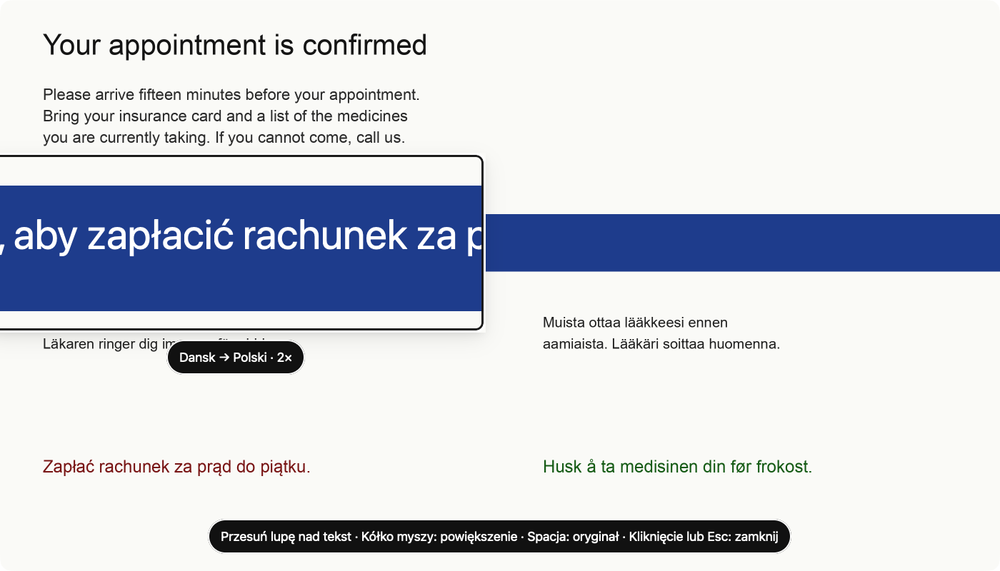

# Polyloupe

Lupa, która tłumaczy tekst na ekranie. Wyciągasz ją, najeżdżasz na tekst,
a tekst pod lupą jest już przetłumaczony, w tym samym miejscu i w tych samych
kolorach. Kółkiem myszy powiększasz. Program jest pomyślany dla starszych osób.



- **Offline:** tłumaczenie modelami Firefox Translations, bez wysyłania ekranu do chmury.
- **Języki:** polski, angielski, duński, szwedzki, fiński, norweski — dowolne pary.
- **Dostęp:** przycisk w oknie, ikona na pasku menu / w trayu, Dock, skrót Ctrl+Alt+L.
- **Dostępność:** WCAG 2.1 AA, obsługa samą klawiaturą — zob. [docs/dostepnosc.md](docs/dostepnosc.md).

## Uruchomienie

```sh
cargo run --release
```

Za pierwszym razem program pobiera słowniki (ok. 25 MB na język). Na macOS
trzeba pozwolić na „Nagrywanie ekranu” (okno główne prowadzi do Ustawień).

Do pracy nad lupą bez zrzutu ekranu:

```sh
cargo run --release -- --image docs/sample.png --at 330,340 --zoom 2
```

## Struktura

| Crate | Zawartość |
|---|---|
| `crates/app` (`polyloupe`) | Aplikacja GPUI Kit: okno główne, lupa, tray, skrót, zrzut ekranu |
| `crates/ocr` | Rozpoznawanie tekstu (Apple Vision) i łączenie linii w akapity |
| `crates/translate` | Tłumaczenie offline (`fxtranslate`), wykrywanie języka (`lingua`) |

Jak to działa: zrzut monitora pod kursorem → OCR całego ekranu → akapity →
wykrycie języka → tłumaczenie (najpierw to, co pod lupą) → w lupie tłumaczenie
rysowane jest na tle próbkowanym z otoczenia.

## Stan

| | macOS | Windows | Linux |
|---|---|---|---|
| Lupa, tłumaczenie, tray, skrót | ✅ | 🟡 niesprawdzone | 🟡 niesprawdzone (Wayland: ograniczenia) |
| OCR | ✅ Vision | ❌ (plan: Windows.Media.Ocr) | ❌ (plan: Tesseract) |

Szczegóły i ryzyka: [docs/platformy.md](docs/platformy.md).
Silniki tłumaczenia i dostawcy chmurowi: [docs/tlumaczenie.md](docs/tlumaczenie.md).
